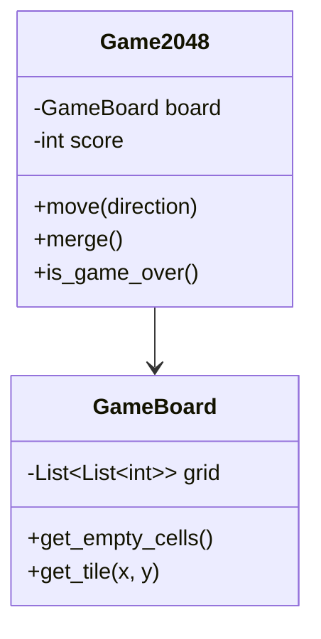

# MetaGPT 專案研究報告（三）：核心模組詳解

## 一、Roles 模組（角色系統）

### 1.1 軟體開發角色體系

MetaGPT 實現了完整的軟體開發團隊角色：

```
Software Development Team
├── ProductManager（產品經理）
│   ├── Actions:
│   │   ├── WritePRD（撰寫產品需求文檔）
│   │   └── WritePRDReview（審查 PRD）
│   └── Output: PRD（產品需求文檔）
│
├── Architect（架構師）
│   ├── Actions:
│   │   ├── DesignAPI（設計 API）
│   │   └── DesignAPIReview（審查 API 設計）
│   └── Output: 系統設計文檔、API 規範
│
├── ProjectManager（專案經理）
│   ├── Actions:
│   │   └── ProjectManagement（專案管理）
│   └── Output: 任務分解、JSON 格式的任務列表
│
├── Engineer（工程師）
│   ├── Actions:
│   │   ├── WriteCode（編寫代碼）
│   │   ├── WriteCodeReview（代碼審查）
│   │   └── WriteDesign（撰寫設計文檔）
│   └── Output: 可執行的代碼檔案
│
└── QAEngineer（測試工程師）
    ├── Actions:
    │   └── WriteTest（編寫測試）
    └── Output: 測試代碼、測試報告
```

### 1.2 ProductManager（產品經理）

**檔案位置**：`metagpt/roles/product_manager.py`

**職責**：
- 接收用戶需求
- 進行競品分析
- 撰寫產品需求文檔（PRD）
- 定義用戶故事

**核心實作**：

```python
class ProductManager(Role):
    name: str = "Alice"
    profile: str = "Product Manager"
    goal: str = "efficiently create a successful product"

    def __init__(self, **kwargs):
        super().__init__(**kwargs)

        # 設置可執行的動作
        self.set_actions([WritePRD])

        # 訂閱用戶需求和需求變更
        self._watch([UserRequirement, AddRequirement])
```

**WritePRD Action 實作**：

```python
class WritePRD(Action):
    """撰寫 PRD（產品需求文檔）"""

    name: str = "WritePRD"

    async def run(self, requirements: list[Message]) -> ActionOutput:
        """
        基於用戶需求生成 PRD

        輸出包含：
        - 產品目標
        - 用戶故事
        - 需求列表
        - 約束條件
        - 成功指標
        """
        # 構建提示詞
        prompt = PROMPT_TEMPLATE.format(
            requirements="\n".join([r.content for r in requirements])
        )

        # 呼叫 LLM
        prd_content = await self._aask(prompt)

        # 結構化輸出
        prd = ActionOutput(
            content=prd_content,
            instruct_content=PRDDocument.model_validate_json(prd_content)
        )

        return prd
```

**輸出範例（PRD 文檔結構）**：

```yaml
Product Requirements Document:
  Product Goals:
    - 創建一個有趣的 2048 遊戲
    - 支援鍵盤和觸控操作
    - 提供分數追蹤和最高分記錄

  User Stories:
    - 作為玩家，我希望能使用方向鍵移動方塊
    - 作為玩家，我希望能看到當前分數
    - 作為玩家，我希望遊戲結束時能重新開始

  Competitive Analysis:
    - 2048.game: 簡潔的 UI，但缺乏動畫效果
    - 2048 Plus: 有多種主題，但性能較差

  Requirement Analysis:
    - 難點：合併邏輯的實現
    - 難點：平滑的動畫效果

  Requirement Pool:
    - P0: 核心遊戲邏輯
    - P0: 基本 UI
    - P1: 動畫效果
    - P2: 主題切換
```

### 1.3 Architect（架構師）

**檔案位置**：`metagpt/roles/architect.py`

**職責**：
- 根據 PRD 設計系統架構
- 定義數據結構
- 設計 API 接口
- 選擇技術棧

**核心實作**：

```python
class Architect(Role):
    name: str = "Bob"
    profile: str = "Architect"
    goal: str = "design a concise, usable, complete software system"

    def __init__(self, **kwargs):
        super().__init__(**kwargs)

        # 設置動作
        self.set_actions([DesignAPI])

        # 訂閱 PRD 完成事件
        self._watch([WritePRD, DirectWritePRD])
```

**DesignAPI Action**：

```python
class DesignAPI(Action):
    """設計 API 接口"""

    async def run(self, prd: Message) -> ActionOutput:
        """
        基於 PRD 設計 API

        輸出包含：
        - 數據結構定義
        - API 接口列表
        - 類圖（Mermaid 格式）
        - 序列圖
        """
        # 提取 PRD 內容
        prd_content = prd.instruct_content

        # 生成 API 設計
        api_design = await self._design_api(prd_content)

        # 生成類圖
        class_diagram = await self._design_class_diagram(api_design)

        # 生成序列圖
        sequence_diagram = await self._design_sequence_diagram(api_design)

        return ActionOutput(
            content=api_design,
            instruct_content=SystemDesign(
                api_design=api_design,
                class_view=class_diagram,
                sequence_view=sequence_diagram
            )
        )
```

**輸出範例（系統設計文檔）**：

```python
# Data Structures
class GameBoard:
    """遊戲板"""
    grid: List[List[int]]  # 4x4 網格
    score: int
    best_score: int

class Tile:
    """方塊"""
    value: int
    position: Tuple[int, int]

# API Design
class Game2048:
    def __init__(self):
        """初始化遊戲"""

    def move(self, direction: str) -> bool:
        """移動方塊
        Args:
            direction: 'up', 'down', 'left', 'right'
        Returns:
            是否移動成功
        """

    def merge(self) -> int:
        """合併相同的方塊
        Returns:
            本次合併獲得的分數
        """

    def add_random_tile(self):
        """隨機添加新方塊"""

    def is_game_over(self) -> bool:
        """檢查遊戲是否結束"""
```

**類圖（Mermaid 格式）**：



### 1.4 Engineer（工程師）

**檔案位置**：`metagpt/roles/engineer.py`

**職責**：
- 根據系統設計實作代碼
- 編寫模組化的代碼
- 確保代碼質量
- 處理依賴關係

**核心實作**：

```python
class Engineer(Role):
    name: str = "Alex"
    profile: str = "Engineer"
    goal: str = "write elegant, readable, extensible, efficient code"

    def __init__(self, **kwargs):
        super().__init__(**kwargs)

        # 設置動作
        self.set_actions([WriteCode])

        # 訂閱架構設計完成事件
        self._watch([DesignAPI, DesignReview])

        # 使用 PLAN_AND_ACT 模式
        self.use_plan = kwargs.get("use_plan", True)
```

**WriteCode Action（增強版）**：

```python
class WriteCode(Action):
    """編寫代碼"""

    async def run(self, design: Message) -> ActionOutput:
        """
        基於設計文檔編寫代碼

        流程：
        1. 分析設計文檔
        2. 確定文件結構
        3. 逐個文件生成代碼
        4. 自我審查代碼
        """
        system_design = design.instruct_content

        # 1. 規劃文件結構
        file_plan = await self._plan_files(system_design)

        # 2. 逐個文件生成代碼
        code_files = {}
        for file_info in file_plan:
            code = await self._write_single_file(
                file_info,
                system_design
            )
            code_files[file_info.filename] = code

        # 3. 生成 requirements.txt
        dependencies = await self._extract_dependencies(code_files)
        code_files["requirements.txt"] = "\n".join(dependencies)

        # 4. 保存代碼
        await self._save_code(code_files)

        return ActionOutput(
            content=f"Generated {len(code_files)} files",
            instruct_content=CodeSummary(files=code_files)
        )

    async def _write_single_file(self, file_info, design):
        """生成單個文件的代碼"""
        prompt = CODE_TEMPLATE.format(
            filename=file_info.filename,
            design=design.api_design,
            dependencies=file_info.dependencies
        )

        code = await self._aask(prompt)

        # 自我審查
        if self.config.repair_llm_output:
            code = await self._review_code(code)

        return code
```

**代碼生成範例**：

生成的 `game2048.py`：

```python
"""
2048 Game Implementation
"""
import random
from typing import List, Tuple


class GameBoard:
    """遊戲板類"""

    def __init__(self, size: int = 4):
        """初始化遊戲板"""
        self.size = size
        self.grid = [[0] * size for _ in range(size)]
        self.score = 0
        self.best_score = 0
        self._add_random_tile()
        self._add_random_tile()

    def move(self, direction: str) -> bool:
        """移動方塊"""
        if direction not in ['up', 'down', 'left', 'right']:
            raise ValueError(f"Invalid direction: {direction}")

        original_grid = [row[:] for row in self.grid]

        if direction == 'left':
            self._move_left()
        elif direction == 'right':
            self._move_right()
        elif direction == 'up':
            self._move_up()
        else:  # down
            self._move_down()

        # 檢查是否有移動
        moved = original_grid != self.grid

        if moved:
            self._add_random_tile()

        return moved

    def _move_left(self):
        """向左移動"""
        for row in self.grid:
            self._merge_row(row)

    # ... 更多方法
```

### 1.5 QAEngineer（測試工程師）

**檔案位置**：`metagpt/roles/qa_engineer.py`

**職責**：
- 為代碼編寫測試
- 執行測試並報告結果
- 確保代碼質量

**核心實作**：

```python
class QAEngineer(Role):
    name: str = "Edward"
    profile: str = "QA Engineer"
    goal: str = "write comprehensive and robust test cases"

    def __init__(self, **kwargs):
        super().__init__(**kwargs)

        # 設置動作
        self.set_actions([WriteTest])

        # 訂閱代碼完成事件
        self._watch([WriteCode, FixBug])
```

**WriteTest Action**：

```python
class WriteTest(Action):
    """編寫測試代碼"""

    async def run(self, code: Message) -> ActionOutput:
        """
        為代碼編寫測試

        輸出：
        - 單元測試
        - 集成測試
        - 測試覆蓋率報告
        """
        code_files = code.instruct_content.files

        # 為每個文件生成測試
        test_files = {}
        for filename, code_content in code_files.items():
            if filename.endswith('.py') and filename != 'requirements.txt':
                test_code = await self._write_test_for_file(
                    filename,
                    code_content
                )
                test_files[f"test_{filename}"] = test_code

        # 生成 test requirements
        test_files["requirements-test.txt"] = "pytest>=7.0\npytest-cov>=4.0"

        return ActionOutput(
            content=f"Generated {len(test_files)} test files",
            instruct_content=TestSummary(files=test_files)
        )
```

**生成的測試代碼範例**：

```python
"""
Test cases for Game2048
"""
import pytest
from game2048 import GameBoard


class TestGameBoard:
    """GameBoard 的測試類"""

    def test_init(self):
        """測試初始化"""
        board = GameBoard()
        assert board.size == 4
        assert board.score == 0
        # 應該有兩個非零的方塊
        non_zero_count = sum(1 for row in board.grid for cell in row if cell != 0)
        assert non_zero_count == 2

    def test_move_left(self):
        """測試向左移動"""
        board = GameBoard()
        board.grid = [
            [2, 2, 0, 0],
            [0, 0, 0, 0],
            [0, 0, 0, 0],
            [0, 0, 0, 0]
        ]
        moved = board.move('left')
        assert moved
        assert board.grid[0][0] == 4
        assert board.score == 4

    def test_is_game_over(self):
        """測試遊戲結束檢測"""
        board = GameBoard()
        # 填滿棋盤且無法合併
        board.grid = [
            [2, 4, 2, 4],
            [4, 2, 4, 2],
            [2, 4, 2, 4],
            [4, 2, 4, 2]
        ]
        assert board.is_game_over() == True

    # ... 更多測試
```

### 1.6 其他專業角色

#### Researcher（研究員）

**檔案位置**：`metagpt/roles/researcher.py`

**用途**：執行網路研究，撰寫研究報告

```python
class Researcher(Role):
    """研究員角色"""

    def __init__(self, **kwargs):
        super().__init__(**kwargs)
        self.set_actions([
            CollectLinks,      # 收集相關連結
            WebBrowseAndSummarize,  # 瀏覽並總結
            ConductResearch,   # 執行研究
            WriteReport        # 撰寫報告
        ])
```

**應用場景**：
- 技術調研
- 市場分析
- 競品分析
- 學術研究

#### DataInterpreter（數據解釋器）

**檔案位置**：`metagpt/roles/di/data_interpreter.py`

**特色**：能夠編寫並執行代碼

```python
class DataInterpreter(Role):
    """數據解釋器：編寫並執行代碼"""

    def __init__(self, **kwargs):
        super().__init__(**kwargs)
        self.set_actions([
            Plan,          # 規劃任務
            WritePlan,     # 撰寫計劃
            WriteCode,     # 編寫代碼
            RunCode,       # 執行代碼
            DebugCode      # 調試代碼
        ])

        # 使用沙盒執行環境
        self.use_docker = True
```

**執行流程**：

```python
# 用戶請求
di = DataInterpreter()
result = await di.run("分析 Iris 資料集並繪製散點圖")

# 執行流程：
# 1. Plan：理解任務，生成執行計劃
# 2. WriteCode：生成 pandas/matplotlib 代碼
# 3. RunCode：在沙盒中執行代碼
# 4. 如果出錯：DebugCode 修正錯誤
# 5. 返回結果（包括圖表）
```

---

## 二、Actions 模組（動作系統）

### 2.1 Action 基類設計

**檔案位置**：`metagpt/actions/action.py`

**核心屬性**：

```python
class Action(SerializationMixin, ContextMixin, BaseModel):
    name: str = ""                        # 動作名稱
    i_context: Union[dict, str, None]    # 輸入上下文
    prefix: str = ""                      # System prompt
    desc: str = ""                        # 描述
    node: ActionNode = None               # 結構化輸出節點
    llm_name_or_type: Optional[str] = None  # 私有 LLM

    async def run(self, *args, **kwargs):
        """執行動作（子類必須實作）"""
        raise NotImplementedError

    async def _aask(self, prompt: str, system_msgs: list = None) -> str:
        """呼叫 LLM"""
        return await self.llm.aask(prompt, system_msgs)
```

### 2.2 ActionNode（結構化輸出）

**檔案位置**：`metagpt/actions/action_node.py`

ActionNode 是 MetaGPT 實現結構化輸出的關鍵機制。

**設計理念**：

```python
# 定義期望的輸出結構
class PRDDocument(BaseModel):
    product_goals: List[str]
    user_stories: List[str]
    competitive_analysis: str
    requirements: Dict[str, str]

# 創建 ActionNode
prd_node = ActionNode(
    key="PRD",
    expected_type=PRDDocument,
    instruction="Generate a Product Requirements Document",
    example=PRDDocument(
        product_goals=["Goal 1", "Goal 2"],
        user_stories=["Story 1"],
        competitive_analysis="Analysis here",
        requirements={"P0": "Core feature"}
    )
)

# 使用
result = await prd_node.fill(context="User wants a 2048 game", llm=llm)
# result 是一個 PRDDocument 實例
```

**實作細節**：

```python
class ActionNode(BaseModel):
    key: str                              # 節點名稱
    expected_type: Type[BaseModel]        # 期望類型
    instruction: str                      # 指示
    example: Any                          # 範例
    schema: str = "json"                  # 輸出格式：json/markdown/raw

    async def fill(self, context: str, llm: BaseLLM) -> BaseModel:
        """填充節點"""
        # 1. 構建提示詞
        prompt = self._get_prompt(context)

        # 2. 呼叫 LLM
        if llm.use_function_call and self.schema == "json":
            # 使用 function calling
            result = await self._fill_with_function_call(llm, context)
        else:
            # 使用傳統提示詞
            raw_output = await llm.aask(prompt)
            result = self._parse_output(raw_output)

        # 3. 驗證並返回
        return self.expected_type.model_validate(result)

    def _get_prompt(self, context: str) -> str:
        """構建提示詞"""
        prompt = f"""
{self.instruction}

Context:
{context}

Please generate output in the following format:
{self.expected_type.model_json_schema()}

Example:
{self.example.model_dump_json(indent=2)}

Your output (JSON format):
"""
        return prompt
```

**優勢**：
- 類型安全：使用 Pydantic 模型
- 自動驗證：輸出自動驗證
- 支援 Function Calling：GPT-4 等模型可用
- 錯誤修復：自動修復格式錯誤

### 2.3 常用 Actions

#### WriteCode

**檔案位置**：`metagpt/actions/write_code.py`

**功能**：根據設計文檔生成代碼

**提示詞模板**：

```python
PROMPT_TEMPLATE = """
## context
{context}

## Design
```
{design}
```

## Task
Write code for {filename} based on the design.

## Requirements
1. Follow PEP8 style guide
2. Add type hints
3. Include docstrings
4. Handle errors appropriately
5. Write clean, readable code

## Output
Return the complete code for {filename}.
"""
```

#### WriteTest

**檔案位置**：`metagpt/actions/write_test.py`

**功能**：為代碼生成測試

**特點**：
- 生成 pytest 格式的測試
- 包含邊界條件測試
- 添加測試覆蓋率

#### DebugError

**檔案位置**：`metagpt/actions/debug_error.py`

**功能**：自動修復代碼錯誤

**流程**：

```python
async def run(self, error_info: str, code: str) -> str:
    """
    調試錯誤

    Args:
        error_info: 錯誤訊息
        code: 有問題的代碼

    Returns:
        修正後的代碼
    """
    prompt = f"""
## Error
```
{error_info}
```

## Current Code
```python
{code}
```

## Task
Fix the error in the code above.

## Output
Return the corrected code.
"""

    fixed_code = await self._aask(prompt)
    return fixed_code
```

#### SearchAndSummarize

**檔案位置**：`metagpt/actions/search_and_summarize.py`

**功能**：搜索並總結資訊

```python
class SearchAndSummarize(Action):
    async def run(self, query: str) -> str:
        # 1. 搜索
        search_results = await self._search(query)

        # 2. 提取關鍵資訊
        key_info = await self._extract_info(search_results)

        # 3. 總結
        summary = await self._summarize(key_info)

        return summary
```

---

## 三、Provider 模組（LLM 提供商）

### 3.1 BaseLLM 抽象基類

**檔案位置**：`metagpt/provider/base_llm.py`

**核心方法**：

```python
class BaseLLM(ABC):
    config: LLMConfig
    model: str
    cost_manager: CostManager

    # === 核心抽象方法（子類必須實作）===

    @abstractmethod
    async def _achat_completion(self, messages: list, timeout: int):
        """聊天完成（核心方法）"""

    @abstractmethod
    async def acompletion(self, messages: list, timeout: int):
        """文本完成"""

    @abstractmethod
    async def _achat_completion_stream(self, messages: list, timeout: int):
        """流式輸出"""

    # === 高層方法（已實作）===

    async def aask(
        self,
        msg: str,
        system_msgs: list = None,
        images: list = None,
        timeout: int = USE_CONFIG_TIMEOUT
    ) -> str:
        """
        詢問 LLM（高層接口）

        流程：
        1. 構建消息列表
        2. 壓縮消息（如果需要）
        3. 呼叫底層 completion 方法
        4. 更新成本
        """
        # 1. 構建消息
        messages = []

        if self.use_system_prompt:
            messages.append(self._default_system_msg())

        if system_msgs:
            messages.extend([self._system_msg(m) for m in system_msgs])

        messages.append(self._user_msg(msg, images=images))

        # 2. 壓縮（如果超過限制）
        compressed = self.compress_messages(messages)

        # 3. 呼叫
        rsp = await self.acompletion_text(compressed, timeout=timeout)

        return rsp

    def compress_messages(self, messages: list) -> list:
        """壓縮消息以符合 token 限制"""
        total_tokens = self.get_total_tokens(messages)

        if total_tokens <= self.config.max_token:
            return messages

        # 壓縮策略：保留系統消息和最後幾條消息
        system_msgs = [m for m in messages if m["role"] == "system"]
        user_msgs = [m for m in messages if m["role"] != "system"]

        # 保留最後 N 條
        compressed = system_msgs + user_msgs[-3:]

        return compressed

    def _update_costs(self, usage: dict, model: str = None):
        """更新成本"""
        if self.cost_manager:
            prompt_tokens = usage.get("prompt_tokens", 0)
            completion_tokens = usage.get("completion_tokens", 0)
            self.cost_manager.update_cost(
                prompt_tokens,
                completion_tokens,
                model or self.model
            )
```

### 3.2 OpenAI Provider

**檔案位置**：`metagpt/provider/openai_api.py`

**支援的模型**：
- OpenAI: GPT-4, GPT-3.5
- Fireworks AI
- Moonshot
- DeepSeek
- Mistral
- Yi (零一萬物)
- 其他 OpenAI 兼容的服務

**實作**：

```python
@register_provider([
    LLMType.OPENAI,
    LLMType.FIREWORKS,
    LLMType.MOONSHOT,
    LLMType.DEEPSEEK,
    LLMType.MISTRAL,
    LLMType.YI,
    # ... 更多
])
class OpenAILLM(BaseLLM):
    def __init__(self, config: LLMConfig):
        self.config = config
        self.model = config.model
        self._init_client()

    def _init_client(self):
        """初始化 OpenAI 客戶端"""
        kwargs = {
            "api_key": self.config.api_key,
            "base_url": self.config.base_url,
        }

        # 代理設置
        if proxy_params := self._get_proxy_params():
            kwargs["http_client"] = AsyncHttpxClientWrapper(**proxy_params)

        # 超時設置
        if self.config.timeout:
            kwargs["timeout"] = self.config.timeout

        self.aclient = AsyncOpenAI(**kwargs)

    async def _achat_completion(self, messages: list, timeout: int = USE_CONFIG_TIMEOUT):
        """聊天完成"""
        response = await self.aclient.chat.completions.create(
            **self._cons_kwargs(messages, timeout=timeout)
        )

        # 更新成本
        self._update_costs(response.usage.model_dump(), self.model)

        return response

    async def _achat_completion_stream(self, messages: list, timeout: int):
        """流式輸出"""
        response = await self.aclient.chat.completions.create(
            **self._cons_kwargs(messages, timeout=timeout),
            stream=True
        )

        collected = []
        async for chunk in response:
            if chunk.choices:
                content = chunk.choices[0].delta.content or ""
                log_llm_stream(content)  # 實時日誌
                collected.append(content)

        full_response = "".join(collected)
        return full_response

    def _cons_kwargs(self, messages: list, timeout: int) -> dict:
        """構建請求參數"""
        kwargs = {
            "messages": messages,
            "model": self.model,
            "temperature": self.config.temperature or 0.7,
            "timeout": self.get_timeout(timeout),
        }

        # Function calling 支援
        if self.config.use_function_call:
            kwargs["tools"] = self.config.tools
            kwargs["tool_choice"] = "auto"

        return kwargs
```

**Function Calling 支援**：

```python
# 定義工具
tools = [{
    "type": "function",
    "function": {
        "name": "generate_prd",
        "description": "Generate a Product Requirements Document",
        "parameters": PRDDocument.model_json_schema()
    }
}]

# 呼叫
config = LLMConfig(
    api_type="openai",
    model="gpt-4-turbo",
    use_function_call=True,
    tools=tools
)

llm = OpenAILLM(config)
response = await llm.aask("Create a PRD for a 2048 game")
```

### 3.3 Anthropic Provider

**檔案位置**：`metagpt/provider/anthropic_api.py`

**支援的模型**：
- Claude 3.5 Sonnet
- Claude 3 Opus/Sonnet/Haiku

**特點**：
- 支援 Extended Thinking（推理模式）
- System Prompt 獨立參數
- 最大 200K token 上下文

**實作**：

```python
@register_provider([LLMType.ANTHROPIC, LLMType.CLAUDE])
class AnthropicLLM(BaseLLM):
    async def _achat_completion(self, messages: list, timeout: int):
        """Anthropic 聊天完成"""
        kwargs = self._const_kwargs(messages)

        response = await self.aclient.messages.create(**kwargs)

        # 更新成本
        self._update_costs({
            "prompt_tokens": response.usage.input_tokens,
            "completion_tokens": response.usage.output_tokens
        })

        return response

    def _const_kwargs(self, messages: list, stream: bool = False) -> dict:
        """構建 Anthropic 特定的參數"""
        kwargs = {
            "model": self.model,
            "messages": messages,
            "max_tokens": self.config.max_token or 4096,
            "stream": stream,
        }

        # Claude 的 system prompt 是獨立參數
        if self.use_system_prompt and messages[0]["role"] == "system":
            kwargs["system"] = messages[0]["content"]
            kwargs["messages"] = messages[1:]  # 移除 system message

        # Extended Thinking（推理模式）
        if self.config.reasoning:
            kwargs["thinking"] = {
                "type": "enabled",
                "budget_tokens": self.config.reasoning_max_token or 10000
            }

        return kwargs
```

**Extended Thinking 範例**：

```yaml
# config2.yaml
llm:
  api_type: anthropic
  model: claude-3-5-sonnet-20241022
  reasoning: true
  reasoning_max_token: 16000
```

使用推理模式時，Claude 會先「思考」再回答，提供更準確的結果。

### 3.4 本地模型支援（Ollama）

**檔案位置**：`metagpt/provider/ollama_api.py`

**支援的模型**：
- Llama 3.1/3.2
- Qwen
- Mistral
- Gemma
- 其他 Ollama 支援的模型

**配置範例**：

```yaml
# config2.yaml
llm:
  api_type: ollama
  base_url: http://localhost:11434
  model: llama3.1
```

**使用**：

```bash
# 1. 安裝 Ollama
# 2. 拉取模型
ollama pull llama3.1

# 3. 使用 MetaGPT
metagpt "Create a snake game"
```

**優勢**：
- 完全本地運行，無隱私顧慮
- 無 API 費用
- 無網路依賴

---

## 四、Tools 模組（工具系統）

### 4.1 搜索引擎工具

**支援的搜索引擎**：
- Google Custom Search API
- Bing Search API
- SerpAPI
- Serper API
- DuckDuckGo

**使用範例**：

```python
from metagpt.tools import SearchEngineType
from metagpt.tools.search_engine import SearchEngine

# 配置
search = SearchEngine.from_search_config(
    search_engine=SearchEngineType.GOOGLE,
    api_key="YOUR_API_KEY",
    cse_id="YOUR_CSE_ID"
)

# 搜索
results = await search.run("MetaGPT multi-agent framework")

# 結果
# [
#   {"title": "...", "link": "...", "snippet": "..."},
#   ...
# ]
```

### 4.2 網頁瀏覽工具

**支援的瀏覽器引擎**：
- Playwright（推薦）
- Selenium

**使用範例**：

```python
from metagpt.tools.web_browser_engine import WebBrowserEngine

# 初始化
browser = WebBrowserEngine.from_browser_config(
    engine="playwright",
    browser_type="chromium"
)

# 瀏覽網頁
page_content = await browser.run("https://example.com")

# 提取資訊
links = await browser.get_links()
text = await browser.get_text()

# 截圖
await browser.screenshot("page.png")
```

### 4.3 代碼執行工具

**檔案位置**：`metagpt/tools/libs/shell.py`

**安全機制**：
- Docker 沙盒
- 資源限制
- 超時控制

**使用**：

```python
from metagpt.actions.run_code import RunCode

# 執行代碼
run_code = RunCode()
result = await run_code.run(code="""
import pandas as pd

df = pd.read_csv('data.csv')
print(df.head())
""")

# 結果包含：
# - stdout：標準輸出
# - stderr：錯誤輸出
# - return_code：返回碼
```

---

## 五、總結

### 5.1 模組化設計優勢

MetaGPT 的模組化設計帶來以下優勢：

1. **角色可組合**：可以自由組合不同的角色
2. **動作可重用**：Action 可以在多個 Role 中重用
3. **Provider 可切換**：輕鬆切換不同的 LLM
4. **工具可擴展**：容易添加新的工具

### 5.2 核心模組清單

| 模組 | 路徑 | 用途 |
|------|------|------|
| Roles | `metagpt/roles/` | 各種專業角色 |
| Actions | `metagpt/actions/` | 可執行的動作 |
| Provider | `metagpt/provider/` | LLM 提供商 |
| Tools | `metagpt/tools/` | 外部工具整合 |
| Memory | `metagpt/memory/` | 記憶系統 |
| RAG | `metagpt/rag/` | 檢索增強生成 |

---

**報告撰寫時間**：2025-11-10
**分析基於版本**：MetaGPT v1.0.0
**報告作者**：ICSC 研究團隊
