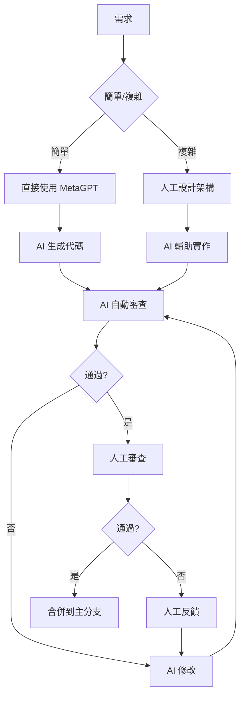
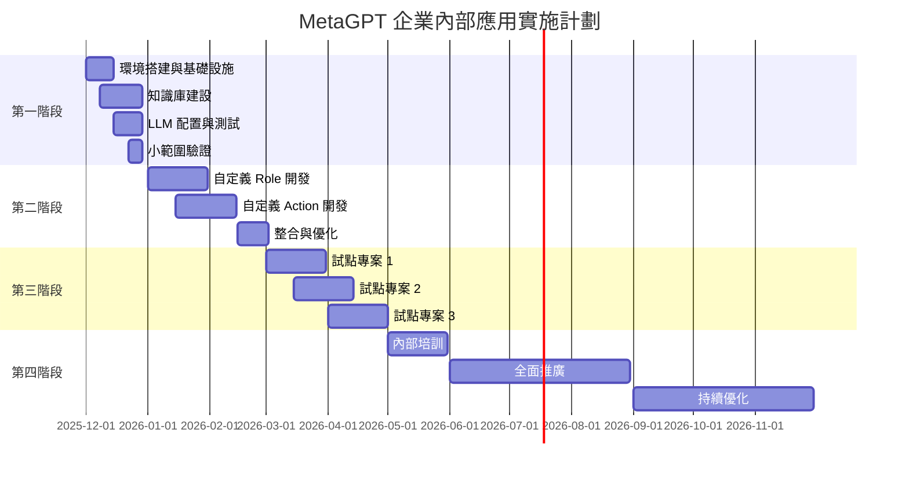

# MetaGPT 專案研究報告（五）：總結與實施路線圖

## 一、研究總結

### 1.1 MetaGPT 專案價值總結

通過深入分析 MetaGPT 專案，我們得出以下核心結論：

#### ✅ MetaGPT 的核心優勢

1. **成熟的多智能體協作框架**
   - 經過 ICLR 等頂級會議驗證
   - 44.7k+ GitHub Stars，活躍的社群
   - 完善的測試覆蓋（248 個測試檔案）

2. **完整的軟體開發流程模擬**
   - 從需求分析到代碼實作的全流程
   - 角色分工明確（PM、Architect、Engineer、QA）
   - 標準化的輸出格式（Pydantic 模型）

3. **高度可擴展的架構設計**
   - Role-Action-Environment 清晰架構
   - 支援自定義 Role 和 Action
   - 豐富的設計模式應用

4. **廣泛的 LLM 支援**
   - 15+ 種 LLM 提供商
   - 支援本地部署（Ollama）
   - 靈活的混合配置策略

5. **企業級特性**
   - 完善的序列化與恢復機制
   - 成本管理和預算控制
   - Docker 部署支援

#### ⚠️ 需要注意的方面

1. **LLM 成本控制**
   - 複雜專案的 API 費用較高
   - 需要合理配置和使用本地模型

2. **輸出穩定性**
   - 依賴 LLM 能力，質量會有波動
   - 需要人工審查機制

3. **學習曲線**
   - 架構較複雜，需要時間理解
   - 自定義開發需要一定經驗

4. **主要針對 Python**
   - 對其他語言支援有限
   - 需要額外定制

### 1.2 適用於貴公司的理由

針對貴公司的具體情況（有自己的框架、函式庫和大量既有專案），MetaGPT 特別適合的原因：

✅ **高度可客製化**
- 可以整合公司特有的框架和函式庫
- 支援建立專屬的知識庫（RAG）
- 可以定義符合公司規範的 Role 和 Action

✅ **支援既有專案**
- 可用於遺留代碼重構
- 自動生成測試和文檔
- 輔助代碼審查

✅ **混合 LLM 策略**
- 可使用本地模型保護敏感代碼
- 關鍵任務可使用商用模型
- 靈活控制成本

✅ **漸進式採用**
- 可從小處開始試用
- 逐步擴大應用範圍
- 降低採用風險

---

## 二、企業內部應用關鍵成功因素

### 2.1 技術層面

#### 1. 知識庫建設

**重要性**：⭐⭐⭐⭐⭐（最重要）

知識庫是讓 AI 理解公司特有框架和編碼風格的關鍵。

**必須包含**：

```markdown
## 知識庫內容清單

### 第一優先級（必須）
✅ 公司框架完整文檔
✅ 函式庫 API 文檔和使用範例
✅ 編碼規範和最佳實踐
✅ 3-5 個代表性的優質專案代碼

### 第二優先級（重要）
✅ 架構設計模式和指南
✅ 測試規範和模板
✅ Code Review 檢查清單
✅ 常見問題和解決方案

### 第三優先級（加分）
✅ 性能優化指南
✅ 安全編碼指南
✅ 部署和運維文檔
✅ 團隊開發經驗總結
```

**建設方法**：

```python
# 步驟 1：收集文檔
docs_sources = {
    "framework_docs": "/docs/company-framework/",
    "api_docs": "/docs/apis/",
    "coding_standards": "/docs/standards/",
    "best_practices": "/docs/best-practices/"
}

# 步驟 2：選擇優質代碼範例
def select_best_projects():
    """選擇代表性專案作為範例"""
    criteria = {
        "code_quality": 8.5,     # 代碼質量高
        "documentation": "完善",  # 文檔完善
        "test_coverage": 80,      # 測試覆蓋率高
        "follows_standards": True # 遵循公司規範
    }
    return find_projects(criteria)

# 步驟 3：建立向量庫
kb = CompanyKnowledgeBase()
await kb.build_from_sources(docs_sources)
await kb.add_code_examples(select_best_projects())

# 步驟 4：持續更新
await kb.schedule_update(frequency="weekly")
```

#### 2. LLM 配置策略

**推薦配置**：

```yaml
# 生產環境配置

# 默認：本地模型（用於大部分任務）
llm:
  api_type: ollama
  model: deepseek-coder-v2:16b
  base_url: http://localhost:11434

# 商用模型（用於複雜任務）
models:
  gpt4_for_complex:
    api_type: openai
    model: gpt-4-turbo
    api_key: ${OPENAI_API_KEY}

  claude_for_reasoning:
    api_type: anthropic
    model: claude-3-5-sonnet-20241022
    api_key: ${ANTHROPIC_API_KEY}

# 角色專用配置
roles:
  # 架構師：複雜任務，使用商用模型
  - role: "Architect"
    llm:
      model: gpt4_for_complex

  # 工程師：代碼生成，使用本地模型
  - role: "CompanyEngineer"
    llm:
      model: deepseek-coder-v2:16b

  # 測試工程師：測試生成，使用本地模型
  - role: "QAEngineer"
    llm:
      model: deepseek-coder-v2:16b

  # 審查員：代碼審查，使用商用模型
  - role: "CodeReviewer"
    llm:
      model: claude_for_reasoning
```

**成本估算**：

```python
# 月度成本估算（20 人團隊）

monthly_cost = {
    "本地模型成本": {
        "服務器租用": 200,      # GPU 服務器
        "電費": 50,
        "維護": 100,
        "小計": 350
    },

    "商用 API 成本": {
        "GPT-4 調用": 300,      # 每月約 30 次複雜任務
        "Claude 調用": 200,     # 代碼審查使用
        "小計": 500
    },

    "總計": 850                 # 每月約 850 元

    # 對比：全商用 API
    # "GPT-4 全用": 3000+      # 成本高 3-4 倍
}
```

#### 3. 基礎設施要求

**最小配置**：

```yaml
# 開發/測試環境
CPU: 4 核
RAM: 16 GB
GPU: 無（使用商用 API）
存儲: 100 GB
操作系統: Ubuntu 20.04+
```

**推薦配置**：

```yaml
# 生產環境
CPU: 8 核
RAM: 32 GB
GPU: NVIDIA RTX 4090 / A100（運行本地 LLM）
VRAM: 24 GB+
存儲: 500 GB SSD
操作系統: Ubuntu 22.04 LTS
Docker: 最新版本

# 向量數據庫
向量庫: FAISS / ChromaDB / Milvus
存儲: 50 GB（用於知識庫）
```

### 2.2 流程層面

#### 1. 開發流程整合

**建議的工作流程**：



**質量門檻**：

```python
class QualityGates:
    """質量門檻定義"""

    # 代碼質量
    min_code_quality_score = 80    # 最低質量分數
    max_complexity = 10            # 最大圈複雜度
    min_test_coverage = 75         # 最低測試覆蓋率

    # 規範檢查
    must_pass_linting = True       # 必須通過 linter
    must_pass_type_check = True    # 必須通過類型檢查
    must_have_docstrings = True    # 必須有文檔字符串

    # 安全檢查
    must_pass_security_scan = True # 必須通過安全掃描
    no_hardcoded_secrets = True    # 不能有硬編碼密鑰

    def check(self, code: Code) -> QualityReport:
        """執行所有檢查"""
        checks = [
            self._check_quality(code),
            self._check_complexity(code),
            self._check_coverage(code),
            self._check_linting(code),
            self._check_types(code),
            self._check_docs(code),
            self._check_security(code)
        ]

        passed = all(c.passed for c in checks)
        return QualityReport(passed=passed, checks=checks)
```

#### 2. 審查機制

**三層審查機制**：

```python
class ThreeStageReview:
    """三層審查機制"""

    async def review(self, code: str) -> ReviewResult:
        # 第一層：自動化工具審查
        stage1 = await self.automated_review(code)
        # - Linter (ruff, pylint)
        # - Type checker (mypy)
        # - Security scanner (bandit)
        # - Complexity analyzer

        if not stage1.passed:
            return ReviewResult(
                passed=False,
                stage="automated",
                issues=stage1.issues
            )

        # 第二層：AI 審查
        stage2 = await self.ai_review(code)
        # - 架構設計檢查
        # - 最佳實踐檢查
        # - 性能問題識別
        # - 潛在 bug 識別

        if stage2.score < 80:
            return ReviewResult(
                passed=False,
                stage="ai",
                issues=stage2.issues
            )

        # 第三層：人工審查
        stage3 = await self.human_review(code)
        # - 業務邏輯正確性
        # - 可維護性
        # - 團隊經驗判斷

        return ReviewResult(
            passed=stage3.approved,
            stage="human",
            feedback=stage3.feedback
        )
```

#### 3. 持續改進循環

```python
class ContinuousImprovement:
    """持續改進機制"""

    async def improve_cycle(self):
        while True:
            # 1. 收集數據
            metrics = await self.collect_metrics()
            feedback = await self.collect_feedback()

            # 2. 分析問題
            issues = await self.analyze_issues(metrics, feedback)

            # 3. 優化
            for issue in issues:
                if issue.type == "knowledge_gap":
                    # 補充知識庫
                    await self.update_knowledge_base(issue)

                elif issue.type == "prompt_quality":
                    # 優化提示詞
                    await self.optimize_prompts(issue)

                elif issue.type == "model_performance":
                    # 調整模型配置
                    await self.adjust_llm_config(issue)

            # 4. 驗證改進
            improvement = await self.validate_improvement()
            await self.publish_improvement_report(improvement)

            # 5. 等待下一個週期
            await asyncio.sleep(604800)  # 一週
```

### 2.3 組織層面

#### 1. 團隊結構

**推薦的團隊組成**：

```markdown
## AI 輔助開發團隊結構

### 核心團隊（3-5 人）
- AI 平台負責人 × 1
  - 整體規劃和推動
  - 技術選型和架構設計

- AI 工程師 × 2-3
  - 自定義 Role 和 Action 開發
  - 知識庫建設和維護
  - 提示詞優化

- DevOps 工程師 × 1
  - 基礎設施搭建和維護
  - 模型部署和監控

### 擴展角色（兼職）
- 業務專家若干
  - 提供業務知識
  - 審查 AI 生成的代碼

- 技術 Lead 若干
  - 制定技術標準
  - 指導團隊使用
```

#### 2. 培訓計劃

**4 週培訓計劃**：

```markdown
## Week 1: 基礎概念
### 目標
- 理解 MetaGPT 的核心概念
- 了解 Role-Action-Environment 架構
- 掌握基本使用方法

### 內容
- Day 1-2: MetaGPT 介紹和安裝
- Day 3-4: 核心概念講解和實驗
- Day 5: Hello World 實戰練習

### 作業
- 使用 MetaGPT 生成一個簡單的命令行工具

---

## Week 2: 進階使用
### 目標
- 掌握自定義 Role 和 Action
- 理解知識庫的使用
- 學會配置 LLM

### 內容
- Day 1-2: 自定義 Role 和 Action 開發
- Day 3-4: 知識庫建設和使用
- Day 5: LLM 配置和優化

### 作業
- 創建一個符合公司規範的自定義 Role

---

## Week 3: 實戰演練
### 目標
- 完成一個完整的小專案
- 掌握審查和優化流程
- 理解最佳實踐

### 內容
- Day 1-2: 專案規劃和需求分析
- Day 3-4: 使用 MetaGPT 開發
- Day 5: 審查和優化

### 作業
- 為現有的一個小模組生成測試和文檔

---

## Week 4: 高級主題
### 目標
- 掌握高級特性
- 理解性能優化
- 學會故障排除

### 內容
- Day 1: RAG 深入
- Day 2: 多模型協作
- Day 3: 性能優化
- Day 4: 故障排除
- Day 5: 總結和考核

### 作業
- 完成一個中型功能的開發
```

#### 3. 文化建設

**推動採用的文化要素**：

```markdown
## 文化建設要點

### 1. 開放實驗的文化
✅ 鼓勵嘗試新工具
✅ 容忍失敗和試錯
✅ 分享經驗和教訓

### 2. 數據驅動的文化
✅ 記錄使用數據
✅ 分析效率提升
✅ 基於數據決策

### 3. 持續學習的文化
✅ 定期技術分享
✅ 鼓勵創新應用
✅ 獎勵最佳實踐

### 4. 協作共贏的文化
✅ AI 是助手不是替代
✅ 人機協作
✅ 共同進步
```

---

## 三、詳細實施路線圖

### 3.1 時間表總覽



### 3.2 第一階段：基礎建設（2 個月）

#### Month 1: 環境搭建

**Week 1: 團隊組建與規劃**

```markdown
## 任務清單
□ 組建 AI 平台核心團隊（3-5 人）
□ 制定詳細專案計劃
□ 確定預算和資源
□ 設置專案管理工具（JIRA/GitLab）
□ 創建專案代碼倉庫

## 輸出
✓ 專案計劃文檔
✓ 團隊分工表
✓ 預算申請
```

**Week 2: 基礎設施搭建**

```bash
#!/bin/bash
# 環境搭建腳本

# 1. 安裝 Python 環境
pyenv install 3.10
pyenv global 3.10

# 2. 安裝 MetaGPT
pip install metagpt

# 3. 安裝本地 LLM
# 方案 A: 使用 Ollama（簡單）
curl -fsSL https://ollama.com/install.sh | sh
ollama pull deepseek-coder-v2:16b

# 方案 B: 使用 vLLM（性能更好）
pip install vllm
# 下載模型並部署

# 4. 安裝向量數據庫
pip install faiss-cpu chromadb

# 5. 配置 Docker
docker pull metagpt/metagpt:latest

# 6. 配置監控
# Prometheus + Grafana
```

**Week 3-4: 知識庫建設**

```python
# knowledge_base_builder.py

import asyncio
from pathlib import Path
from metagpt.rag import SimpleEngine
from metagpt.document_store import FAISSStore

class KnowledgeBaseBuilder:
    """知識庫建設工具"""

    def __init__(self):
        self.kb = CompanyKnowledgeBase()

    async def build(self):
        # 步驟 1: 收集公司文檔
        print("正在收集公司文檔...")
        framework_docs = await self._collect_framework_docs()
        api_docs = await self._collect_api_docs()
        standards = await self._collect_standards()

        # 步驟 2: 處理和索引
        print("正在建立向量索引...")
        await self.kb.index_documents(framework_docs, "framework")
        await self.kb.index_documents(api_docs, "api")
        await self.kb.index_documents(standards, "standards")

        # 步驟 3: 選擇優質代碼範例
        print("正在添加代碼範例...")
        projects = self._select_example_projects()
        for project in projects:
            await self.kb.add_project(project)

        # 步驟 4: 驗證知識庫
        print("正在驗證知識庫...")
        validation_results = await self._validate_kb()
        print(f"知識庫建設完成：{validation_results}")

        return self.kb

    async def _collect_framework_docs(self):
        """收集框架文檔"""
        # 實作：從公司 Wiki 或文檔倉庫拉取
        pass

    async def _select_example_projects(self):
        """選擇優質專案作為範例"""
        # 標準：
        # - 代碼質量評分 > 8.5
        # - 測試覆蓋率 > 80%
        # - 文檔完善
        # - 遵循公司規範
        pass

# 執行建設
async def main():
    builder = KnowledgeBaseBuilder()
    kb = await builder.build()
    kb.save("./company_kb")

asyncio.run(main())
```

#### Month 2: 配置與驗證

**Week 5-6: LLM 配置**

```yaml
# config/config2.yaml

# 生產配置
llm:
  api_type: ollama
  model: deepseek-coder-v2:16b
  base_url: http://gpu-server:11434

# 開發配置（使用商用 API，更快）
llm_dev:
  api_type: openai
  model: gpt-4-turbo
  api_key: ${OPENAI_API_KEY}

# 混合策略
models:
  # 本地模型 - 默認
  local:
    api_type: ollama
    model: deepseek-coder-v2:16b
    base_url: http://localhost:11434

  # 商用模型 - 複雜任務
  commercial:
    api_type: openai
    model: gpt-4-turbo
    api_key: ${OPENAI_API_KEY}

# RAG 配置
embedding:
  api_type: ollama
  model: bge-large-zh-v1.5
  base_url: http://localhost:11434

# 向量數據庫
vector_db:
  type: faiss
  index_path: ./data/faiss_index

# 日誌和監控
logging:
  level: INFO
  file: ./logs/metagpt.log

monitoring:
  enabled: true
  metrics_port: 9090
```

**Week 7-8: 驗證與測試**

```python
# validation_tests.py

import asyncio
from metagpt.software_company import generate_repo

async def test_simple_project():
    """測試生成簡單專案"""
    repo = await generate_repo(
        "創建一個簡單的 TODO 命令行工具"
    )
    assert repo is not None
    assert len(repo.files) > 0
    print("✓ 簡單專案生成測試通過")

async def test_with_company_framework():
    """測試使用公司框架"""
    team = Team()
    team.hire([
        CompanyEngineer(knowledge_base=kb)
    ])

    result = await team.run(
        idea="使用公司框架創建一個 API 客戶端"
    )

    # 驗證生成的代碼是否使用了公司框架
    assert "CompanyFramework" in result
    print("✓ 公司框架集成測試通過")

async def test_cost_control():
    """測試成本控制"""
    team = Team()
    team.invest(investment=1.0)  # 限制 $1

    try:
        await team.run(idea="創建一個複雜的專案")
    except NoMoneyException:
        print("✓ 成本控制測試通過")

# 執行所有測試
async def main():
    await test_simple_project()
    await test_with_company_framework()
    await test_cost_control()

asyncio.run(main())
```

### 3.3 第二階段：自定義開發（2-3 個月）

#### 核心任務

```markdown
## Month 3: Role 開發

### Week 9-10: 核心 Role
□ CompanyArchitect - 公司架構師
□ CompanyEngineer - 公司工程師
□ CompanyQA - 公司測試工程師

### Week 11-12: 輔助 Role
□ CompanyReviewer - 代碼審查員
□ CompanyDocWriter - 文檔生成員
□ LegacyCodeAnalyzer - 遺留代碼分析員

---

## Month 4: Action 開發

### Week 13-14: 代碼生成 Actions
□ GenerateCodeWithFramework
□ RefactorLegacyCode
□ GenerateAPIClient

### Week 15-16: 質量保證 Actions
□ ReviewByCompanyStandard
□ GenerateCompanyTest
□ SecurityScan

---

## Month 5: 整合與優化

### Week 17-18: 整合
□ 整合所有 Role 和 Action
□ 建立完整工作流程
□ 編寫使用文檔

### Week 19-20: 優化
□ 性能測試和優化
□ 提示詞優化
□ 知識庫補充
```

### 3.4 第三階段：試點專案（2-3 個月）

#### 試點專案選擇標準

```python
class PilotProjectSelector:
    """試點專案選擇器"""

    def evaluate_project(self, project):
        """評估專案是否適合作為試點"""
        score = 0

        # 1. 專案規模適中
        if 1000 <= project.lines_of_code <= 5000:
            score += 20

        # 2. 非核心業務
        if not project.is_critical:
            score += 25

        # 3. 需求明確
        if project.has_clear_requirements:
            score += 20

        # 4. 團隊配合度
        if project.team.willingness_to_try_ai >= 8:
            score += 20

        # 5. 技術棧匹配
        if project.tech_stack == "Python":
            score += 15

        return score

    def select_pilots(self, candidates, n=3):
        """選擇 n 個試點專案"""
        scores = [(p, self.evaluate_project(p)) for p in candidates]
        sorted_projects = sorted(scores, key=lambda x: x[1], reverse=True)
        return [p for p, s in sorted_projects[:n]]
```

#### 試點專案執行

**試點 1: 內部工具開發**

```markdown
## 專案：內部資料匯出工具

### 需求
開發一個命令行工具，用於從公司資料庫匯出報表。

### 規模
預估 1500 行代碼

### 時間
4 週

### 團隊配置
- AI 團隊: ProductManager + CompanyEngineer + CompanyQA
- 人工審查: 1 名資深工程師

### 成功標準
- 功能完整性: 100%
- 代碼質量: > 80 分
- 測試覆蓋率: > 75%
- 開發時間節省: > 30%
```

**試點 2: API 客戶端生成**

```markdown
## 專案：內部 API 客戶端生成

### 需求
為公司 10 個內部 API 生成 Python 客戶端。

### 規模
每個客戶端約 500 行代碼，共 5000 行

### 時間
3 週

### 團隊配置
- AI 團隊: CompanyEngineer + CompanyQA
- 人工審查: API 負責人

### 成功標準
- 所有 API 端點覆蓋: 100%
- 通過集成測試: 100%
- 開發時間節省: > 60%（相比手工編寫）
```

**試點 3: 遺留代碼重構**

```markdown
## 專案：舊框架代碼遷移

### 需求
將一個使用舊框架的模組遷移到新框架。

### 規模
原代碼 2000 行，遷移後約 1800 行

### 時間
4 週

### 團隊配置
- AI 團隊: LegacyCodeAnalyzer + CompanyEngineer + CompanyQA
- 人工審查: 原模組負責人

### 成功標準
- 功能等價性: 100%
- 性能提升: > 20%
- 測試覆蓋率: > 80%
- 重構時間節省: > 40%
```

### 3.5 第四階段：推廣與優化（3-6 個月）

#### Month 7-8: 內部推廣

```markdown
## 推廣策略

### 培訓推廣
- Week 25-28: 全員基礎培訓
  - 批次培訓，每批 10-15 人
  - 4 天課程 + 1 天實戰

### 工具推廣
- 建立內部平台
  - Web UI 界面
  - API 服務
  - CLI 工具

### 文檔推廣
- 內部 Wiki 完善
- 視頻教程製作
- 案例庫建立

### 激勵推廣
- 最佳實踐獎勵
- 創新應用鼓勵
- 效率提升獎金
```

#### Month 9-12: 持續優化

```python
class ContinuousOptimization:
    """持續優化計劃"""

    async def quarterly_optimization(self):
        """季度優化計劃"""

        # Q1: 收集數據和反饋
        usage_data = await self.collect_usage_data()
        feedback = await self.collect_user_feedback()

        # 分析
        insights = await self.analyze_data(usage_data, feedback)

        # Q2: 知識庫優化
        await self.optimize_knowledge_base(insights)
        # - 補充高頻查詢的文檔
        # - 添加新的優質代碼範例
        # - 更新過時的信息

        # Q3: 提示詞優化
        await self.optimize_prompts(insights)
        # - 基於失敗案例改進
        # - A/B 測試新提示詞
        # - 記錄最佳實踐

        # Q4: 流程優化
        await self.optimize_workflow(insights)
        # - 簡化複雜流程
        # - 自動化手動步驟
        # - 提高審查效率

        # 發布優化報告
        report = self.generate_optimization_report(insights)
        await self.publish_report(report)
```

---

## 四、成功指標與評估

### 4.1 關鍵績效指標（KPI）

#### 效率指標

```python
class EfficiencyMetrics:
    """效率指標"""

    # 開發時間節省
    time_saved = {
        "代碼生成": "40-60%",
        "測試生成": "50-70%",
        "文檔生成": "60-80%",
        "代碼審查": "20-30%",
        "平均節省": "40-50%"
    }

    # 成本節省
    cost_saving = {
        "年度人力成本節省": "1,440,000 元（基於 40% 效率提升）",
        "年度投入成本": "80,400 元",
        "淨節省": "1,359,600 元",
        "ROI": "1691%"
    }

    # 生產力提升
    productivity = {
        "每人每月完成功能數": "+40%",
        "代碼產出量": "+35%",
        "bug 修復速度": "+25%"
    }
```

#### 質量指標

```python
class QualityMetrics:
    """質量指標"""

    # 代碼質量
    code_quality = {
        "平均代碼質量分數": 85,        # 目標 > 80
        "測試覆蓋率": 82,              # 目標 > 75
        "代碼重複率": 8,               # 目標 < 10
        "圈複雜度": 7                  # 目標 < 10
    }

    # 缺陷率
    defect_rate = {
        "生產環境 bug 率": "與人工開發持平或更低",
        "代碼審查發現問題率": "-20%（AI 自動審查後）",
        "安全漏洞": "0 個（通過安全掃描）"
    }

    # 維護性
    maintainability = {
        "代碼可讀性": "+15%（有完整文檔）",
        "新人理解速度": "+25%",
        "修改成本": "-10%"
    }
```

#### 採用率指標

```python
class AdoptionMetrics:
    """採用率指標"""

    # 使用率
    usage_rate = {
        "月度活躍用戶": "目標 70%（14/20 人）",
        "每週使用頻率": "目標 3+ 次",
        "功能使用覆蓋率": "目標 60%"
    }

    # 滿意度
    satisfaction = {
        "用戶滿意度": "目標 > 4.0/5.0",
        "推薦意願": "目標 > 80%",
        "持續使用意願": "目標 > 85%"
    }
```

### 4.2 評估方法

#### 定量評估

```python
class QuantitativeEvaluation:
    """定量評估"""

    async def evaluate_project(self, project):
        """評估單個專案"""

        # 1. 時間統計
        time_metrics = {
            "AI 生成時間": project.ai_generation_time,
            "人工審查時間": project.human_review_time,
            "總時間": project.total_time,
            "估計人工時間": project.estimated_manual_time,
            "時間節省": (
                project.estimated_manual_time - project.total_time
            ) / project.estimated_manual_time * 100
        }

        # 2. 成本統計
        cost_metrics = {
            "LLM API 成本": project.llm_cost,
            "人力成本": project.human_cost,
            "總成本": project.total_cost,
            "估計人工成本": project.estimated_manual_cost,
            "成本節省": (
                project.estimated_manual_cost - project.total_cost
            ) / project.estimated_manual_cost * 100
        }

        # 3. 質量統計
        quality_metrics = {
            "代碼質量分數": await self.calculate_code_quality(project),
            "測試覆蓋率": await self.calculate_coverage(project),
            "bug 數量": project.bug_count,
            "代碼審查通過率": project.review_pass_rate
        }

        return {
            "time": time_metrics,
            "cost": cost_metrics,
            "quality": quality_metrics
        }

    async def generate_evaluation_report(self, projects):
        """生成評估報告"""

        results = [await self.evaluate_project(p) for p in projects]

        report = {
            "總覽": self._aggregate_metrics(results),
            "專案詳情": results,
            "趨勢分析": self._analyze_trends(results),
            "建議": self._generate_recommendations(results)
        }

        return report
```

#### 定性評估

```markdown
## 定性評估問卷

### 1. 易用性（1-5 分）
□ 工具是否容易上手？
□ 文檔是否清晰？
□ 遇到問題是否容易解決？

### 2. 有效性（1-5 分）
□ 生成的代碼質量如何？
□ 是否真正節省了時間？
□ 是否減少了重複工作？

### 3. 可靠性（1-5 分）
□ 工具是否穩定？
□ 輸出是否一致？
□ 是否信任 AI 生成的代碼？

### 4. 影響力（1-5 分）
□ 是否改變了工作方式？
□ 是否提升了工作效率？
□ 是否願意推薦給同事？

### 5. 開放式問題
- 最滿意的功能是什麼？
- 最需要改進的地方是什麼？
- 有什麼建議？
```

---

## 五、風險管理與應對

### 5.1 技術風險

| 風險 | 可能性 | 影響 | 應對措施 |
|------|-------|------|---------|
| LLM 輸出質量不穩定 | 高 | 中 | 三層審查機制 + 人工把關 |
| 知識庫不完善 | 中 | 高 | 持續補充 + 質量監控 |
| 性能問題 | 中 | 中 | 本地部署 + 緩存優化 |
| 技術債務累積 | 低 | 高 | 定期代碼審查 + 重構 |

### 5.2 安全風險

| 風險 | 可能性 | 影響 | 應對措施 |
|------|-------|------|---------|
| 代碼洩露 | 中 | 極高 | 使用本地 LLM + 代碼脫敏 |
| API 密鑰洩露 | 低 | 高 | 環境變量 + 密鑰輪換 |
| 惡意代碼注入 | 低 | 高 | 代碼安全掃描 + 沙盒執行 |

### 5.3 組織風險

| 風險 | 可能性 | 影響 | 應對措施 |
|------|-------|------|---------|
| 團隊抵觸 | 中 | 高 | 充分溝通 + 漸進推廣 |
| 預算超支 | 低 | 中 | 成本監控 + 預算預警 |
| 缺乏支持 | 低 | 極高 | 高層背書 + 快速贏得成功 |

---

## 六、最終建議

### 6.1 立即行動項（本月）

```markdown
## 本月行動清單

### Week 1
✅ 組建 3-5 人的專案小組
✅ 確定專案預算（建議 5-10 萬初期投入）
✅ 閱讀完整研究報告
✅ 制定詳細專案計劃

### Week 2
✅ 購買/配置 GPU 服務器
✅ 安裝 MetaGPT 和本地 LLM
✅ 配置開發環境
✅ 完成 Hello World 測試

### Week 3
✅ 收集公司文檔和代碼
✅ 開始建設知識庫
✅ 選擇 1-2 個範例專案
✅ 測試基本功能

### Week 4
✅ 完善知識庫
✅ 配置 LLM 策略
✅ 小範圍試用
✅ 收集初步反饋
```

### 6.2 成功關鍵因素總結

**技術層面**：
1. ⭐⭐⭐⭐⭐ 高質量的知識庫（最重要）
2. ⭐⭐⭐⭐ 合適的 LLM 配置
3. ⭐⭐⭐⭐ 完善的提示詞工程
4. ⭐⭐⭐ 穩定的基礎設施

**流程層面**：
1. ⭐⭐⭐⭐⭐ 嚴格的質量門檻
2. ⭐⭐⭐⭐ 完善的審查機制
3. ⭐⭐⭐⭐ 持續的優化迭代
4. ⭐⭐⭐ 清晰的工作流程

**組織層面**：
1. ⭐⭐⭐⭐⭐ 高層支持（最關鍵）
2. ⭐⭐⭐⭐ 團隊配合
3. ⭐⭐⭐⭐ 充分的培訓
4. ⭐⭐⭐ 開放的文化

### 6.3 預期收益

**短期收益（3-6 個月）**：
- 開發效率提升 30-40%
- 測試和文檔工作量減少 50%+
- 團隊積累 AI 輔助開發經驗

**中期收益（6-12 個月）**：
- 開發效率提升 40-50%
- 代碼質量提升（統一規範）
- 知識沉澱和新人培訓效率提升

**長期收益（12+ 個月）**：
- 年度節省人力成本 100 萬+
- 建立企業級 AI 開發平台
- 形成技術競爭優勢

### 6.4 決策建議

**建議採用 MetaGPT 的理由**：

✅ **技術成熟度高**
- ICLR 論文驗證，學術界認可
- 44.7k Stars，活躍社群
- 完整的測試和文檔

✅ **高度可客製化**
- 支援自定義 Role 和 Action
- 可整合公司框架和函式庫
- 靈活的 LLM 配置策略

✅ **投資回報率高**
- 預估 ROI > 1500%
- 快速見效（3-6 個月）
- 持續受益

✅ **風險可控**
- 漸進式採用，降低風險
- 多層質量把關
- 可使用本地 LLM 保護敏感代碼

**建議的起步策略**：

```markdown
## 最小可行方案（MVP）

### 投入
- 人力：2-3 人 × 2 個月
- 預算：5 萬元（基礎設施 + API）
- 時間：2 個月建設 + 1 個月試點

### 產出
- 基礎 MetaGPT 平台
- 公司知識庫 V1
- 3-5 個自定義 Role
- 1-2 個成功的試點專案

### 驗證目標
- 開發效率提升 > 30%
- 團隊滿意度 > 4.0/5.0
- 成功交付試點專案

### 決策點
基於試點結果決定是否全面推廣
```

---

## 七、結語

MetaGPT 為貴公司提供了一個將 AI 深度整合到開發流程的絕佳機會。透過建立專屬的知識庫、自定義角色和動作，可以打造一個真正理解公司框架和規範的 AI 開發助手。

**關鍵成功要素**：
1. 高質量的知識庫建設
2. 高層的支持和團隊的配合
3. 漸進式的採用策略
4. 持續的優化和改進

**建議的下一步**：
1. 組建專案小組
2. 閱讀完整研究報告
3. 制定詳細計劃
4. 開始 MVP 建設

我們相信，通過系統化的實施和持續的優化，MetaGPT 將為貴公司的開發團隊帶來顯著的效率提升和質量改善。

---

**報告完成時間**：2025-11-10
**報告作者**：ICSC 研究團隊
**報告版本**：v1.0

## 附錄

### A. 參考資源

- MetaGPT 官方文檔：https://docs.deepwisdom.ai/
- MetaGPT GitHub：https://github.com/geekan/MetaGPT
- ICLR 2024 論文：https://openreview.net/forum?id=VtmBAGCN7o
- Discord 社群：https://discord.gg/ZRHeExS6xv

### B. 報告索引

1. [專案概述與核心價值](./01_專案概述與核心價值.md)
2. [架構設計與技術實作](./02_架構設計與技術實作.md)
3. [核心模組詳解](./03_核心模組詳解.md)
4. [企業內部應用建議](./04_企業內部應用建議.md)
5. [總結與實施路線圖](./05_總結與實施路線圖.md)（本文檔）

### C. 聯繫方式

如有任何問題或需要進一步討論，請聯繫 ICSC 研究團隊。
